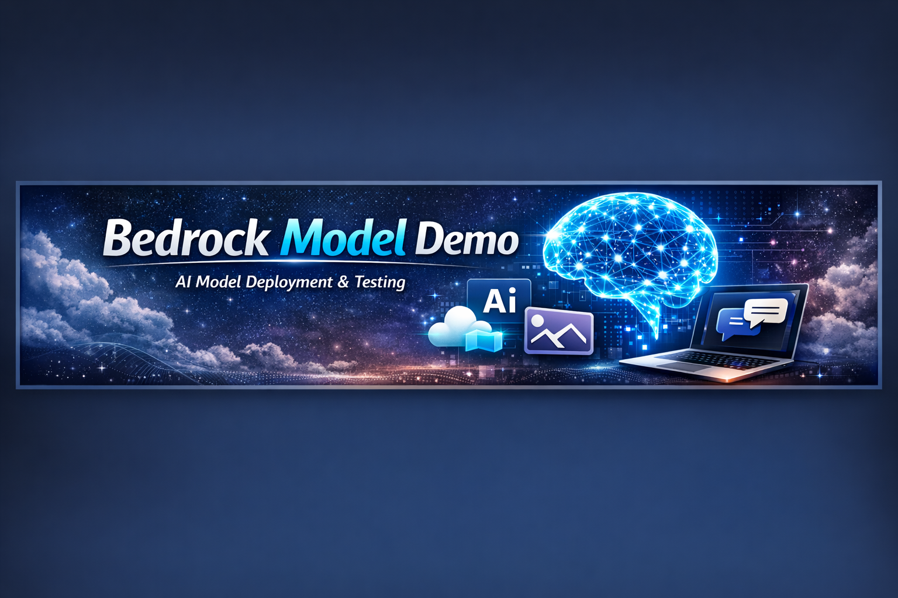
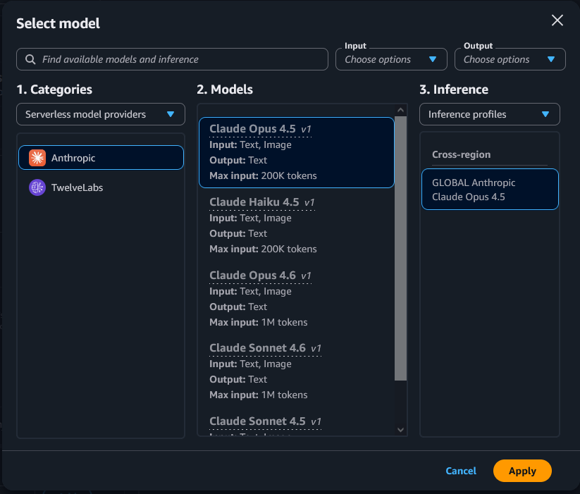
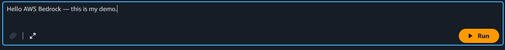
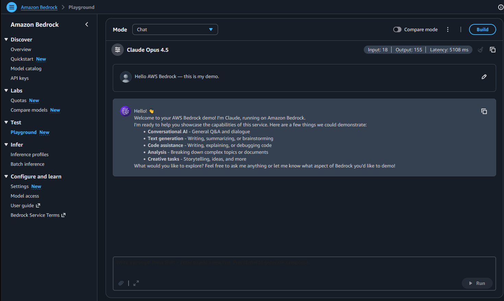

# 🤖 Bedrock Model Demo

This folder documents the use of a foundation model in the Amazon Bedrock playground.  
It provides recruiter‑ready proof snapshots of model selection, prompt submission, and output inference.

---

## 📸 Proof Snapshots

-   
  *Foundation model selected in Amazon Bedrock playground.*

-   
  *Prompt entered and submitted successfully.*

-   
  *Model response displayed — inference executed successfully.*

---

## 🔑 Best Practices

- Snapshot names follow the **[Component] Proof** convention.  
- Captions are **one sentence, professional, and recruiter‑friendly.**  
- Flow: **Select → Prompt → Output.**

---

## 🏁 Conclusion

This folder demonstrates AWS generative AI capabilities through the use of a foundation model in Amazon Bedrock.  
The proof snapshots highlight technical execution, prompt handling, and model inference.  
By documenting this activity, the project emphasizes both technical depth and professional polish — key skills for cloud engineering roles.

[⬅️ Back to Portfolio](https://github.com/Revaun/AWS-Credits-Tracker-Demo.git)