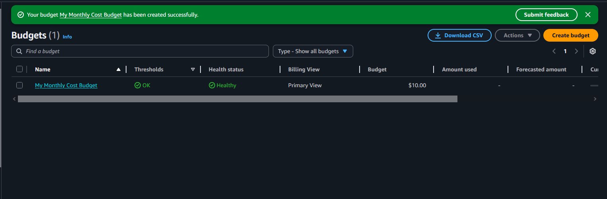
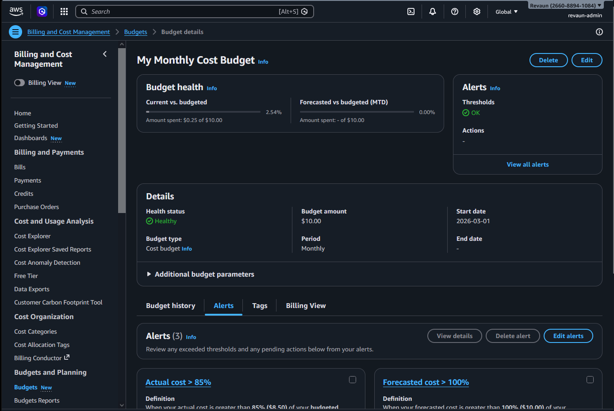

# 💰 AWS Budgets Proof

This folder documents the setup of an AWS Budget for cost management.  
It provides recruiter‑ready proof snapshots showing budget creation, threshold configuration, and dashboard verification.

---

## 📸 Proof Snapshots

-   
  *AWS Budget created — threshold configured.*

-   
  *Budget visible in AWS Budgets dashboard — monitoring enabled.*

---

## 🔑 Best Practices

- Snapshot names follow the **[Component] Proof** convention.  
- Captions are **one sentence, professional, and recruiter‑friendly.**  
- Flow: **Create → Verify → Monitor.**

---

## 🏁 Conclusion

This folder demonstrates proactive AWS cost‑management through the setup of an AWS Budget.  
The proof snapshots highlight financial awareness, threshold configuration, and monitoring discipline.  
By documenting this activity, the project showcases both technical execution and cost control — essential skills for cloud engineering and DevOps roles.

[⬅️ Back to Portfolio](../README.md)

