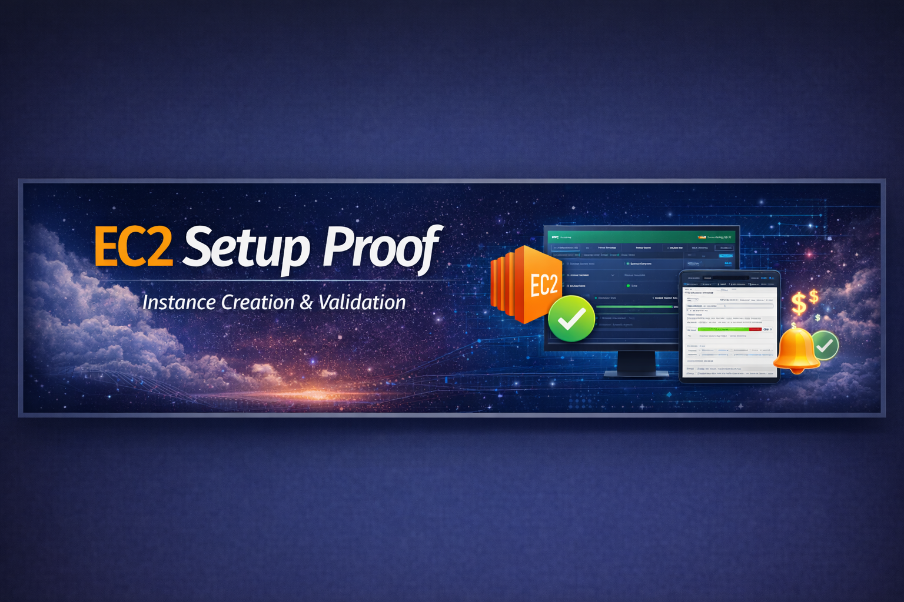
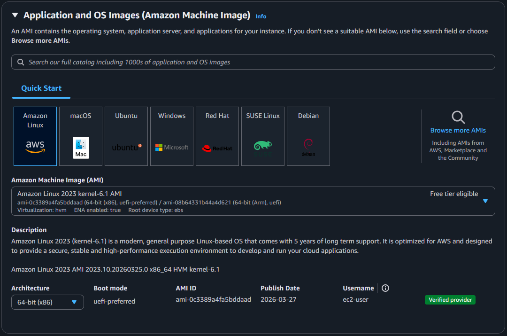
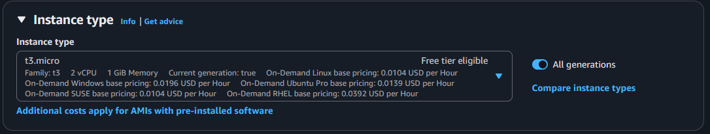
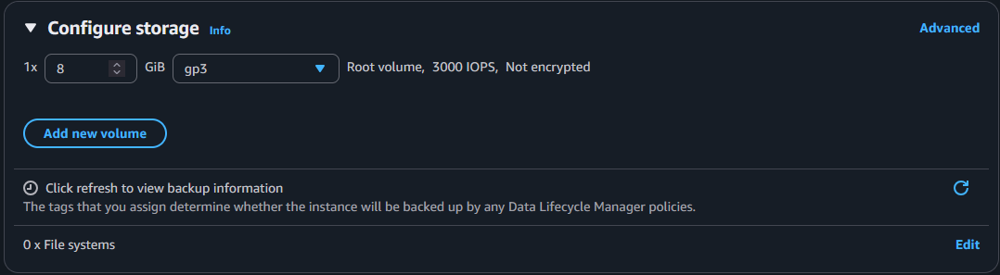
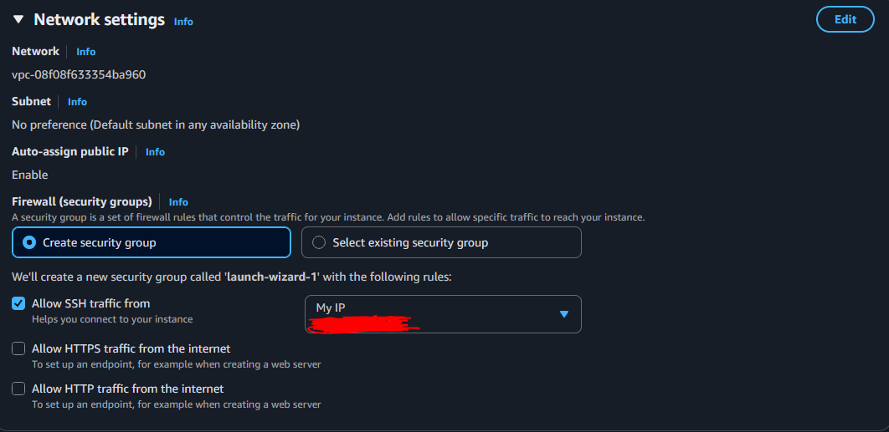
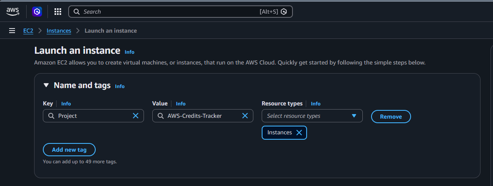
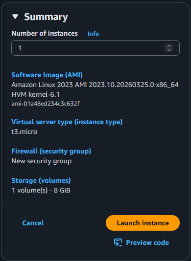
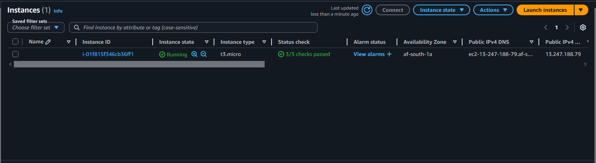

# 🖥️ EC2 Setup Proof

This folder documents the launch and configuration of an AWS EC2 instance in the Cape Town region.  
It provides recruiter‑ready proof snapshots covering instance creation, security setup, SSH access, and hosted content verification.

---

## 📸 Proof Snapshots

### EC2 Setup

-   
  *Amazon Linux 2023 AMI selected for instance launch.*

-   
  *Instance type chosen for demo workload.*

-   
  *Attached storage volumes confirmed.*

-   
  *Secure key pair setup for SSH access.*

-   
  *Inbound rules configured for SSH and HTTP.*

-   
  *Instance tagged for project tracking.*

-   
  *Instance summary details verified.*

-   
  *EC2 instance running in Cape Town — configuration verified.*

---

### Access Verification

-   
  *Secure login to CreditsTracker-EC2 in Cape Town — access verified.*

---

### Hosting Verification

-   
  *Web server running on CreditsTracker-EC2 in Cape Town — hosted content verified.*

---

## 🔑 Best Practices

- Snapshot names follow the **[Component] Proof** convention.  
- Captions are **one sentence, professional, and location‑anchored.**  
- Flow: **Setup → Access → Hosting.**

---

## 🏁 Conclusion

This folder demonstrates AWS compute expertise through the setup of an EC2 instance in the Cape Town region.  
The proof snapshots highlight technical execution, secure access, and hosted content delivery.  
All steps were executed in the Cape Town region (af-south-1), demonstrating local AWS expertise and secure infrastructure setup.  
By documenting this activity, the project emphasizes both technical depth and professional polish — key skills for cloud engineering roles.

[⬅️ Back to Portfolio](https://github.com/Revaun)
