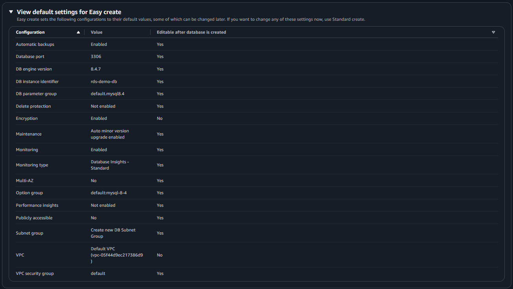
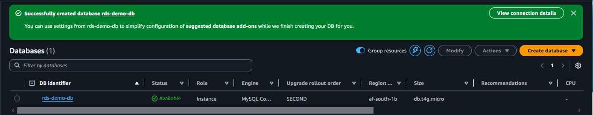
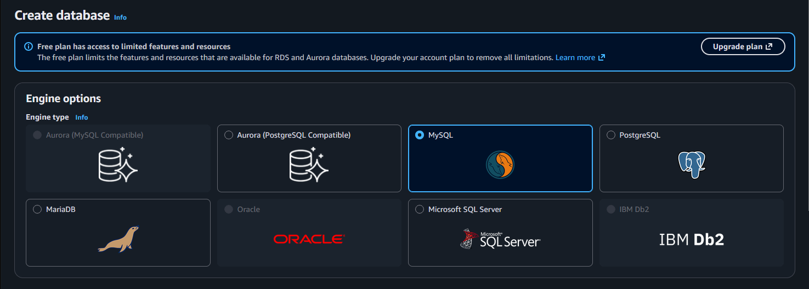
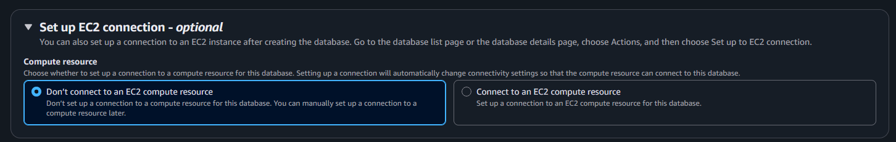
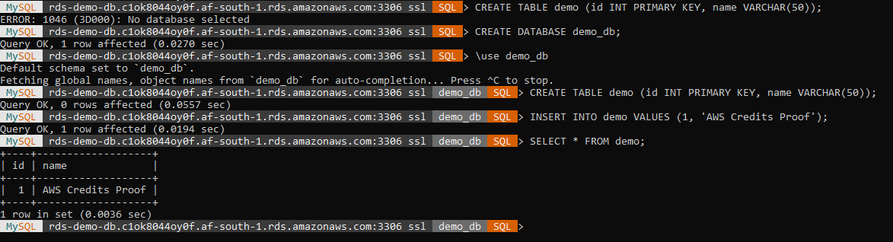

# 🗄️ AWS RDS Demo Proof

## 📖 Project Overview

This demo showcases secure Amazon RDS setup in the **af-south-1 (Cape Town)** region.  
It highlights SSL connectivity, inbound rule configuration, and successful query execution — providing recruiter‑ready proof of hands‑on AWS troubleshooting expertise.

---

## 🔌 Connection Success

Successfully connected to Amazon RDS MySQL instance in the Cape Town region with SSL enabled.  
The MySQL Shell prompt confirms secure connectivity:

```text
MySQL rds-demo-db.c1ok8044oy0f.af-south-1.rds.amazonaws.com:3306 ssl  SQL >
```

---

## 🗄️ Query Proof

Inside the `demo_db` schema, a demo table was created, populated, and queried to confirm functional database operations:

```sql
CREATE TABLE demo (id INT PRIMARY KEY, name VARCHAR(50));
INSERT INTO demo VALUES (1, 'AWS Credits Proof');
SELECT * FROM demo;
```

```text
+----+------------------+
| id | name             |
+----+------------------+
|  1 | AWS Credits Proof|
+----+------------------+
```

---

## 📸 Proof Snapshots

### RDS Setup

-   
  *Database engine and default parameters selected for RDS instance.*

-   
  *RDS instance launched in Cape Town (af-south-1) region — configuration verified.*

-   
  *Allocated storage volumes confirmed.*

-   
  *Inbound rules configured for database connectivity (restricted to My IP).*

---

### Connectivity Verification

-   
  *Secure SSL connection established to RDS instance in af-south-1.*

---

### Query Execution

-   
  *SQL query executed successfully — database operational.*

---

## 🔑 Best Practices

- Snapshot names follow the **[Component] Proof** convention.  
- Captions are concise, professional, and recruiter‑friendly.  
- Flow: **Setup → Connectivity → Query.**

---

## 🏁 Conclusion

This folder demonstrates AWS database expertise through the setup of an RDS instance in the Cape Town region.  
The proof snapshots highlight technical execution, secure connectivity, and query validation.  
All steps were executed in the Cape Town region (af-south-1), demonstrating local AWS expertise and database deployment skills.  
By documenting this activity, the project emphasizes both technical depth and professional polish — key skills for cloud engineering and DevOps roles.


[⬅️ Back to Portfolio](https://github.com/Revaun)

