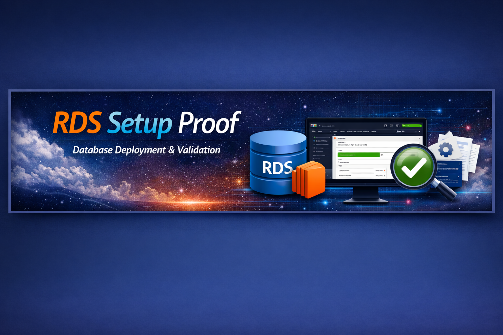

# 🌍 AWS Credits Tracker Demo Portfolio

Welcome to my **AWS Credits Tracker Demo Portfolio** — a recruiter‑ready showcase of hands‑on AWS projects.  
Each folder documents a different AWS service or capability, complete with proof snapshots and polished READMEs.  
All demos were executed in the **af-south-1 (Cape Town)** region to highlight local expertise.

---

## 📂 Project Index

### 🖥️ EC2 Setup Proof
  
Launch and validate an EC2 instance in Cape Town.  
Proof includes AMI selection, instance configuration, SSH access, and hosted web server verification.  
➡️ [View EC2 Setup Proof](EC2-Setup-Proof/)

---

### 🗄️ RDS Database Proof
  
Deploy and connect to an Amazon RDS MySQL instance with SSL enabled.  
Proof includes instance setup, secure connectivity, and SQL query execution.  
➡️ [View RDS Database Proof](RDS-Database-Proof/)

---

### 💰 Budget Proof AWS
  
Configure AWS Budgets for proactive cost management.  
Proof includes budget creation, threshold setup, and monitoring dashboard.  
➡️ [View Budget Proof AWS](BudgetProof-AWS/)

---

### 🤖 Bedrock Model Demo
  
Experiment with Amazon Bedrock foundation models.  
Proof includes model selection, prompt submission, and output inference.  
➡️ [View Bedrock Model Demo](Bedrock-Model-Demo/)

---

### 🌐 AWS Lambda Security Demo

This project demonstrates the end-to-end process of configuring IAM credentials, creating a secure Lambda function, and invoking it successfully.  
Proof includes CLI commands, IAM setup, function deployment, and snapshots showing troubleshooting, correction, and final success.  
➡️ [View LambdaDemo](https://github.com/Revaun/LambdaDemo)

---

## 🎯 Portfolio Highlights

- **Hands‑on AWS expertise** across compute, database, storage, AI, and cost management.  
- **Recruiter‑ready documentation** with banners, proof snapshots, and polished READMEs.  
- **Local region focus**: all demos executed in **af-south-1 (Cape Town)** for region‑specific proof.  
- **Professional polish**: consistent naming, snapshot conventions, and clear navigation links.

---

## 🏁 Conclusion

This portfolio demonstrates technical depth, security awareness, and financial discipline — all critical skills for cloud engineering and DevOps roles.  
Every demo is designed to be recruiter‑friendly, verifiable, and polished for professional presentation.

---

[⬅️ Back to Portfolio](../README.md)
